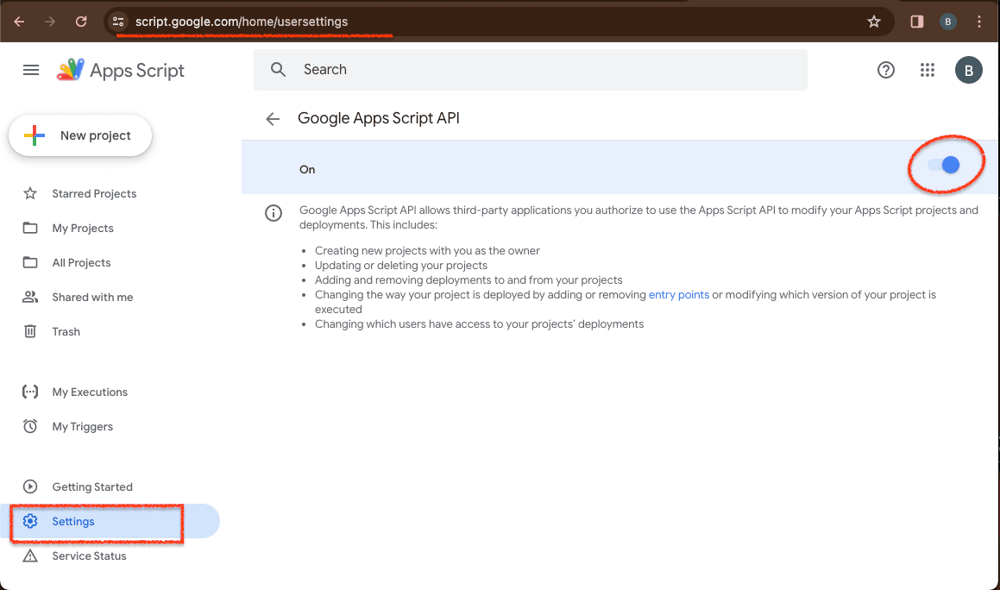
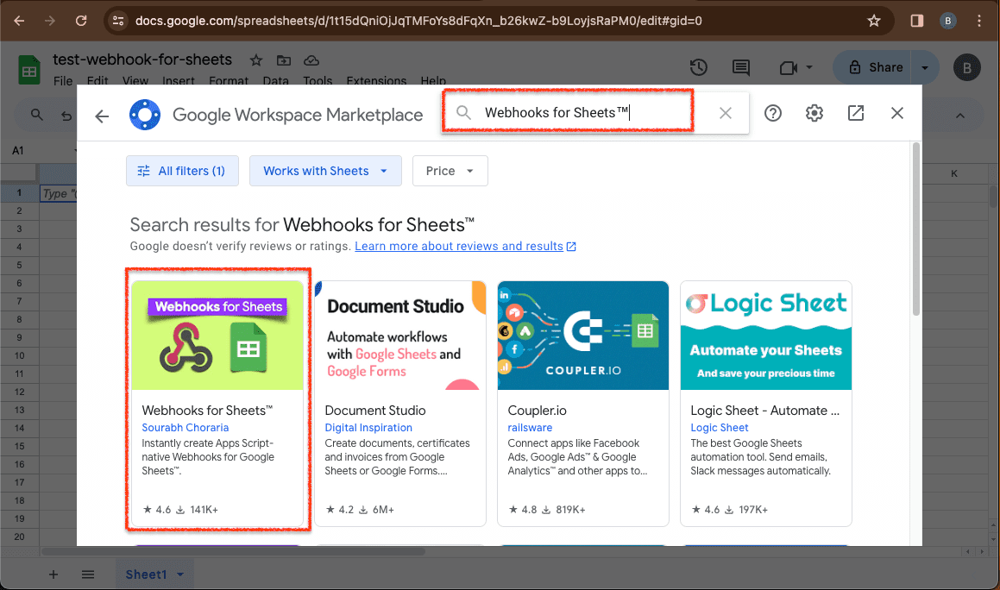
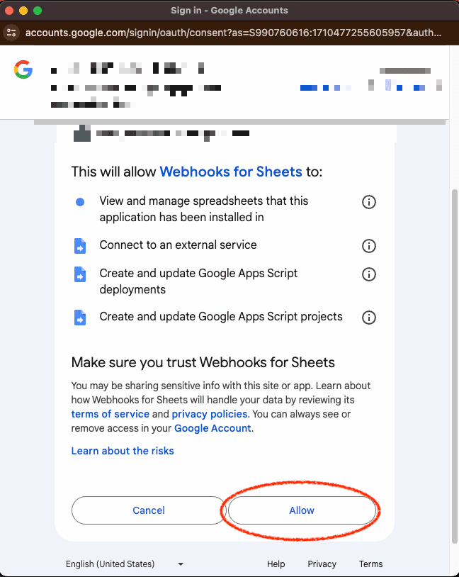
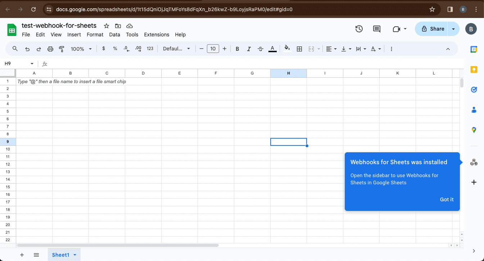

***

    
    
    

***

# &#x1F6A9; Webhooks for Sheets - Google Workspace Add-on Documentation setup and test

 Reference :

   YT : Sourabh Choraria | Webhooks for Sheets — Google Workspace Add-on — Product demo `https://www.youtube.com/watch?v=hj3y0QTykdQ`

## &#x1F3C5; App Script setup stages - native Webhooks for Google Sheets :

    

Apps Scripts for Settings | `https://script.google.com/home/usersettings`

    

    

    

    

    

    

    

    

